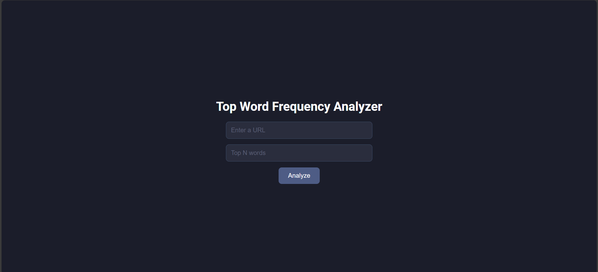
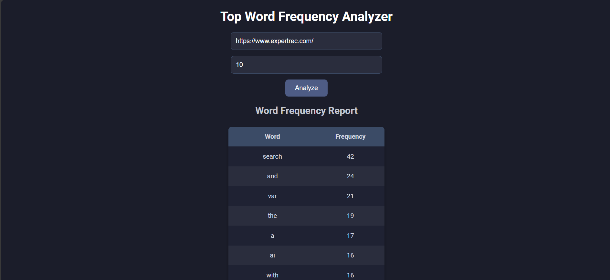
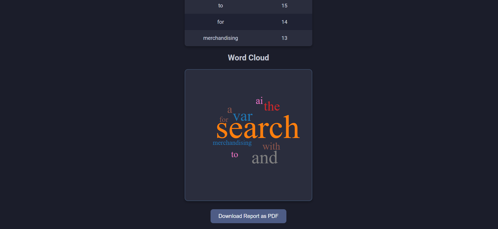
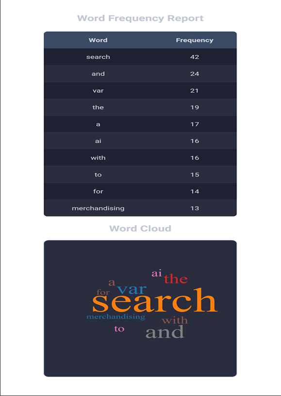

# Word Frequency Analyzer

A web-based tool that scrapes text from a given website, analyzes the frequency of words, and generates an informative report. The report includes a word frequency table and a word cloud visualization, helping users to identify the most common words in the content.

## Features
- **Website Scraping:** Scrapes the text content from any provided URL.
- **Word Frequency Table:** Displays the frequency of each word on the page.
- **Word Cloud:** Visualizes the most frequent words in a dynamic cloud.
- **PDF Download:** Allows the user to download the word frequency report as a PDF.
- **Responsive Design:** Optimized for desktop and mobile screens.

## Technologies Used
- **Frontend:** React.js
- **Backend:** Node.js, Express.js
- **Web Scraping:** JavaScript (Axios & Cheerio)
- **Word Cloud:** `react-wordcloud` library
- **PDF Generation:** jsPDF, html2canvas
- **Styling:** CSS

## Installation

Follow these steps to set up the project locally.

### Prerequisites
Make sure you have Node.js and npm installed. You can download them from [here](https://nodejs.org/).

### Steps to Install
1. Clone this repository:
   ```bash
   git clone https://github.com/HatterByte/Word-Frequency-Analyzer.git
2. Navigate to the project directory:
    ```bash
    cd Word-Frequency-Analyzer

3. Install the dependencies:
    ```bash
    npm install
4. Start the development server (runs both front-end and back-end):
    ```bash
    npm run dev
This will run both the front-end and back-end servers concurrently using concurrently. You can open the project in your browser at http://localhost:3000.

## Usage
1. Enter the URL of a website in the input field and top n words to analyze.
2. Click the "Analyze" button to start scraping the website's text content.
3. View the word frequency table and the generated word cloud.
4. You can download the analysis as a PDF report by clicking the "Download Report as PDF" button.

## Screenshots:
Here are some screenshots showcasing the app:
##### 1. Loading Page

##### 2. Analysis


##### 3. PDF Report
<p align="center">
  
</p>